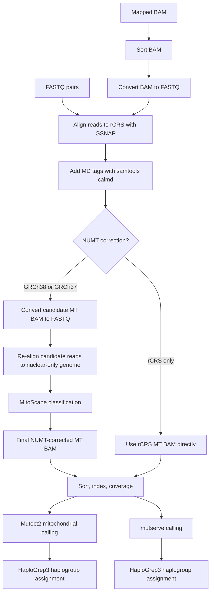

# CLAM Mitochondrial Genome Pipeline

CLAM is a Nextflow pipeline for mitochondrial genome analysis from human WGS-like
data, with a focus on producing a consistently remapped mitochondrial BAM,
performing NUMT-aware correction, and calling mitochondrial variants with both
Mutect2 and mutserve.

This repository is a modernization of an older local CLAM workflow. The current
goal is to make the pipeline reproducible, containerized, cluster-friendly, and
ready for future Seqera Launchpad support.

## Pipeline Logic

The core idea is simple: regardless of whether the starting point is FASTQ or an
already mapped BAM, CLAM rebuilds a consistent mitochondrial analysis space.



## Why Remap?

Public datasets often arrive in different states: raw FASTQ, mapped BAMs, or
alignments produced against different human references. CLAM keeps the current
core workflow conservative by accepting:

- FASTQ pairs, which are mapped directly into the CLAM mitochondrial workflow.
- Mapped BAMs, which are first converted back to FASTQ and then remapped.

This makes downstream mitochondrial analyses more comparable because every
sample passes through the same mapping and filtering logic.

## NUMT-Aware Strategy

Nuclear mitochondrial DNA segments, or NUMTs, can mimic mitochondrial signal in
WGS data. For genome modes that include a nuclear reference, CLAM uses the
classic MitoScape logic:

1. Align reads to the mitochondrial reference.
2. Extract candidate mitochondrial reads.
3. Re-align those candidate reads to a nuclear-only human genome.
4. Use MitoScape, known NUMT regions, linkage disequilibrium data, and the
   bundled classifier model to retain likely true mitochondrial reads.

For `--genome rCRS`, the pipeline intentionally skips the nuclear remapping and
MitoScape branch. This mode is useful for mitochondrial-only analyses, but it is
not NUMT-corrected.

## Supported Inputs

| Input type | Parameter | Expected pattern | Notes |
| --- | --- | --- | --- |
| FASTQ pairs | `--input_type fastq` | `data/*_{R1,R2}.fastq.gz` | Paired-end FASTQ files are grouped with `Channel.fromFilePairs`. |
| BAM | `--input_type bam` | `data/*.bam` | BAMs are sorted, converted to FASTQ, and remapped inside CLAM. |

Example runs:

```bash
nextflow run clam.nf \
  --input 'data/*_{R1,R2}.fastq.gz' \
  --input_type fastq \
  --genome GRCh38
```

```bash
nextflow run clam.nf \
  --input 'data/*.bam' \
  --input_type bam \
  --genome GRCh38
```

## Genome Modes

| Genome | Aliases | NUMT correction | Intended use |
| --- | --- | --- | --- |
| `GRCh38` | `hg38` | Yes | Default WGS mode with GENCODE release 49 GRCh38 nuclear-only remapping. |
| `GRCh37` | `hg19` | Yes | WGS mode for hg19/GRCh37 nuclear-only remapping. The hg19 NUMT resource path still needs final confirmation on the cluster. |
| `rCRS` | `rcrs` | No | Mitochondrial-only mode using rCRS mapping and no nuclear NUMT correction. |

Large nuclear reference genomes and nuclear-only GSNAP indexes are not bundled
in the containers. The small rCRS GSNAP index is bundled in `clam-core` to avoid
GSNAP index-version mismatches during mitochondrial alignment. The normalized
rCRS FASTA used by mutserve is also indexed inside the image, so mutserve does
not need to write index files into the read-only container filesystem.
Nuclear-only GSNAP indexes for NUMT correction are configured in
`conf/genomes.config` and currently point to IEO cluster reference paths.
The GRCh38 nuclear-only index is built with `clam-core:0.1.2` / GSNAP
2025-07-31 from `GRCh38.primary_assembly.nuclear_only.fa`, derived from GENCODE
release 49 `GRCh38.primary_assembly.genome.fa.gz`, and stored at:

```text
/hpcnfs/scratch/ED/genome/clam_refs/gsnap_GRCh38_gencode49
```

## Containers

The pipeline is designed to run with Singularity/Apptainer on the cluster while
using Docker/OCI images as the source:

| Image | Purpose |
| --- | --- |
| `ghcr.io/aledavini7/clam-core:0.1.2` | GSNAP/GMAP, samtools, htslib/bgzip, MitoScape, mutserve, HaploGrep3, a current-format rCRS GSNAP index, indexed rCRS FASTA resources, and bundled small CLAM resources. |
| `ghcr.io/aledavini7/clam-mutect2:0.1.0` | GATK4/Mutect2 runtime. |

Both images are built for `linux/amd64`.
MitoScape is run inside `clam-core` with Java module-opening flags configured
by `params.mitoscape_java_opts`, because its bundled Spark runtime needs access
to Java internals that Java 17 otherwise blocks.

Container build definitions live in:

- `containers/clam-core/`
- `containers/mutect2/`

The GitHub Actions workflow in `.github/workflows/build-clam-core.yml` builds
and publishes both container images to GHCR.

## Seqera Launchpad

The repository includes `nextflow_schema.json` in the root directory. Seqera
uses this file to build the Launchpad parameter form for `input`, `input_type`,
`genome`, and `outdir`.

Suggested Launchpad settings for the first test runs:

| Field | Value |
| --- | --- |
| Pipeline | `https://github.com/aledavini7/clam-mitogenome-pipeline` |
| Revision | `main` or a pinned commit SHA |
| Main script | inferred from `manifest.mainScript = 'clam.nf'` |
| Config profile | leave empty for the current IEO SLURM/Singularity defaults |
| Work directory | an accessible cluster work path, for example `/hpcscratch/ieo/ieo5898/clam-mitogenome-pipeline-work` |

Minimal run parameters:

```json
{
  "input": "/path/to/data/*_{R1,R2}.fastq.gz",
  "input_type": "fastq",
  "genome": "GRCh38",
  "outdir": "results"
}
```

For BAM input:

```json
{
  "input": "/path/to/data/*.bam",
  "input_type": "bam",
  "genome": "GRCh38",
  "outdir": "results"
}
```

## Main Outputs

For each sample, CLAM writes results under:

```text
results/<sample_id>/
```

Core output categories include:

- mitochondrial BAMs from the rCRS alignment and, when enabled, MitoScape
  correction
- BAM index files
- coverage files
- Mutect2 VCFs
- mutserve VCFs
- HaploGrep3 haplogroup reports

## Current Development Status

Implemented in the modernized core:

- DSL2 Nextflow workflow in `clam.nf`
- FASTQ and BAM input modes
- genome mode selection with `GRCh38`, `GRCh37`, and `rCRS`
- containerized CLAM core runtime
- containerized Mutect2 runtime
- SLURM/Singularity-oriented configuration
- `nextflow_schema.json` for Seqera Launchpad

Still planned:

- run the first Seqera Launchpad test
- validate and finalize GRCh37/hg19 NUMT resources
- convert remaining annotation logic into a clean downstream workflow
- decide how WES-specific logic should be exposed
- add test profiles with small synthetic fixtures
- add nf-core-style metadata, documentation, and CI checks

## Development Notes

This repository is being intentionally modernized step by step. The preferred
pattern is:

1. Update one logical piece of the workflow.
2. Run a Nextflow preview or a small test.
3. Commit the change.
4. Move to the next module.

That keeps the old CLAM behavior traceable while making the new implementation
easier to review, run, and eventually launch through Seqera.
