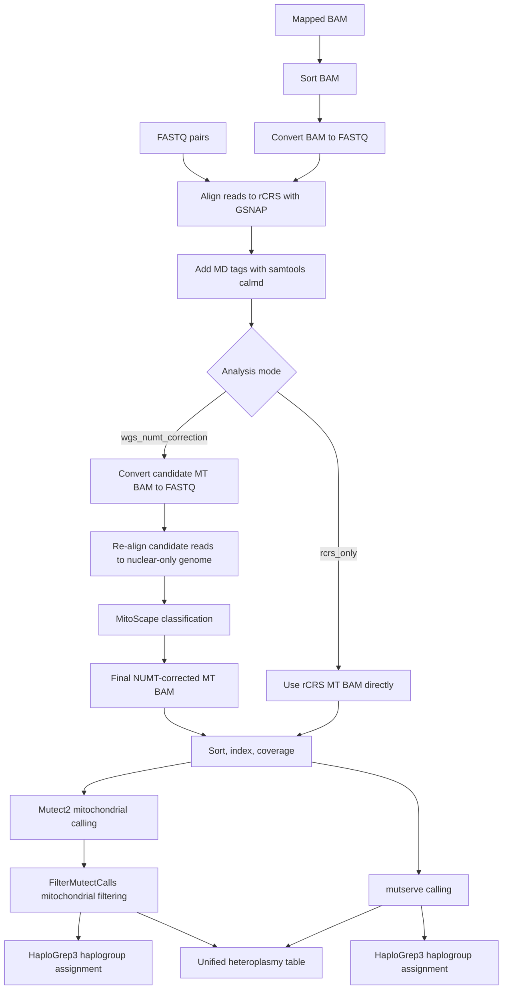

# CLAM Mitochondrial Genome Pipeline

CLAM is a Nextflow pipeline for mitochondrial genome analysis from human WGS-like
data, with a focus on producing a consistently remapped mitochondrial BAM,
performing NUMT-aware correction, and calling mitochondrial variants with both
Mutect2 and mutserve.

This repository is a modernization of an older local CLAM workflow. The current
goal is to make the pipeline reproducible, containerized, cluster-friendly, and
ready for future Seqera Launchpad support.

## Pipeline Logic

The core idea is simple: regardless of whether the starting point is FASTQ or an
already mapped BAM, CLAM rebuilds a consistent mitochondrial analysis space.



## Why Remap?

Public datasets often arrive in different states: raw FASTQ, mapped BAMs, or
alignments produced against different human references. CLAM keeps the current
core workflow conservative by accepting:

- FASTQ pairs, which are mapped directly into the CLAM mitochondrial workflow.
- Mapped BAMs, which are first converted back to FASTQ and then remapped.

This makes downstream mitochondrial analyses more comparable because every
sample passes through the same mapping and filtering logic.

CLAM intentionally creates two MD-tagged mitochondrial BAM representations when
NUMT correction is enabled. The normal `samtools calmd` BAM keeps real read
bases for Mutect2 and mutserve. A separate MitoScape-only `samtools calmd -e`
BAM uses `=` for reference-matching bases, preserving compatibility with
MitoScape's MD parser without exposing that representation to variant callers.

## NUMT-Aware Strategy

Nuclear mitochondrial DNA segments, or NUMTs, can mimic mitochondrial signal in
WGS data. In `wgs_numt_correction` mode, CLAM uses the classic MitoScape logic:

1. Align reads to the mitochondrial reference.
2. Extract candidate mitochondrial reads.
3. Re-align those candidate reads to a nuclear-only human genome.
4. Use MitoScape, known NUMT regions, linkage disequilibrium data, and the
   bundled classifier model to retain likely true mitochondrial reads.

For `--analysis_mode rcrs_only`, the pipeline intentionally skips the nuclear
remapping and MitoScape branch. This mode is useful for mitochondrial-only
analyses, WES-style tests, and quick checks, but it is not NUMT-corrected.

## Supported Inputs

| Input type | Parameter | Expected pattern | Notes |
| --- | --- | --- | --- |
| FASTQ pairs | `--input_type fastq` | `data/*_{R1,R2}.fastq.gz` | Paired-end FASTQ files are grouped with `Channel.fromFilePairs`. |
| BAM | `--input_type bam` | `data/*.bam` | BAMs are sorted, converted to FASTQ, and remapped inside CLAM. |

Example runs:

```bash
nextflow run clam.nf \
  --input 'data/*_{R1,R2}.fastq.gz' \
  --input_type fastq \
  --analysis_mode wgs_numt_correction
```

```bash
nextflow run clam.nf \
  --input 'data/*.bam' \
  --input_type bam \
  --analysis_mode wgs_numt_correction
```

## Analysis Modes

| Mode | NUMT correction | Internal references | Intended use |
| --- | --- | --- | --- |
| `wgs_numt_correction` | Yes | rCRS plus GRCh38 nuclear-only remapping | Full WGS mode with MitoScape NUMT correction. |
| `rcrs_only` | No | rCRS only | Short mitochondrial-only mode with no nuclear remapping. |

Large nuclear reference genomes and nuclear-only GSNAP indexes are not bundled
in the containers. The small rCRS GSNAP index is bundled in `clam-core` to avoid
GSNAP index-version mismatches during mitochondrial alignment. The normalized
rCRS FASTA used by mutserve is also indexed inside the image, so mutserve does
not need to write index files into the read-only container filesystem.
Nuclear-only GSNAP indexes for NUMT correction are configured in
`conf/genomes.config` and currently point to IEO cluster reference paths.
The `wgs_numt_correction` mode always uses a GRCh38 nuclear-only index built
with `clam-core:0.1.2` / GSNAP 2025-07-31 from
`GRCh38.primary_assembly.nuclear_only.fa`, derived from GENCODE release 49
`GRCh38.primary_assembly.genome.fa.gz`, and stored at:

```text
/hpcnfs/scratch/ED/genome/clam_refs/gsnap_GRCh38_gencode49
```

## Containers

The pipeline is designed to run with Singularity/Apptainer on the cluster while
using Docker/OCI images as the source:

| Image | Purpose |
| --- | --- |
| `ghcr.io/aledavini7/clam-core:0.1.2` | GSNAP/GMAP, samtools, htslib/bgzip, MitoScape, mutserve, HaploGrep3, a current-format rCRS GSNAP index, indexed rCRS FASTA resources, and bundled small CLAM resources. |
| `ghcr.io/aledavini7/clam-mitoscape:0.1.0` | Java 8 runtime for the Spark-based MitoScape NUMT classification step. |
| `ghcr.io/aledavini7/clam-mutect2:0.1.0` | GATK4/Mutect2 runtime. |
| `ghcr.io/aledavini7/clam-annotation:0.1.1` | Lightweight Python runtime for mitochondrial variant summary and heteroplasmy tables. |

Both images are built for `linux/amd64`.
MitoScape runs in its own Java 8 container because its bundled Spark/Scala
runtime is not fully compatible with the Java 17 runtime used by `clam-core`.

Container build definitions live in:

- `containers/clam-core/`
- `containers/mitoscape/`
- `containers/mutect2/`
- `containers/annotation/`

The GitHub Actions workflow in `.github/workflows/build-clam-core.yml` builds
and publishes both container images to GHCR.

## Seqera Launchpad

The repository includes `nextflow_schema.json` in the root directory. Seqera
uses this file to build the Launchpad parameter form for `input`, `input_type`,
`analysis_mode`, and `outdir`.

Suggested Launchpad settings for the first test runs:

| Field | Value |
| --- | --- |
| Pipeline | `https://github.com/aledavini7/clam-mitogenome-pipeline` |
| Revision | `main` or a pinned commit SHA |
| Main script | inferred from `manifest.mainScript = 'clam.nf'` |
| Config profile | leave empty for the current IEO SLURM/Singularity defaults |
| Work directory | an accessible cluster work path, for example `/hpcscratch/ieo/ieo5898/clam-mitogenome-pipeline-work` |

Minimal run parameters:

```json
{
  "input": "/path/to/data/*_{R1,R2}.fastq.gz",
  "input_type": "fastq",
  "analysis_mode": "wgs_numt_correction",
  "outdir": "results"
}
```

For BAM input:

```json
{
  "input": "/path/to/data/*.bam",
  "input_type": "bam",
  "analysis_mode": "wgs_numt_correction",
  "outdir": "results"
}
```

## Main Outputs

For each sample, CLAM writes results under:

```text
results/<sample_id>/
```

Core output categories include:

- BAMs under `results/<sample_id>/bams/`: rCRS alignment BAMs,
  MD-tagged BAMs, MitoScape-corrected BAMs, final coordinate-sorted BAMs, and
  BAM index files
- coverage files under `results/<sample_id>/coverage/`
- raw and FilterMutectCalls-filtered Mutect2 VCFs under
  `results/<sample_id>/variants/`
- mutserve VCFs and summaries under `results/<sample_id>/variants/`
- HaploGrep3 haplogroup reports under `results/<sample_id>/haplogroups/`
- annotation TSVs under `results/<sample_id>/annotation/`: caller-specific
  Mutect2 and mutserve tables, an all-calls consensus table, and a
  confidence-filtered consensus table retaining `HIGH` and `MEDIUM` calls with
  final coverage, heteroplasmy estimates, Wilson confidence intervals, and
  confidence tiers
- lightweight maftools-compatible MAF files under
  `results/<sample_id>/annotation/mafs/`, generated from the same annotation
  TSVs. These first-pass MAFs use conservative mitochondrial placeholders
  (`Hugo_Symbol=MTDNA`, `Variant_Classification=RNA`) until richer MITOMAP/VEP
  annotation is added.
- optional MITOMAP-annotated TSVs under
  `results/<sample_id>/annotation/mitomap/` when `--mitomap_variant_table` is
  provided. CLAM expects a local MITOMAP-derived TSV/CSV file and performs exact
  allele matching when possible, falling back to position-level matching.

MITOMAP is maintained as a human mitochondrial genome database and reports
published data on human mtDNA variation. Because MITOMAP resources and terms of
use should be managed explicitly by the user/institute, CLAM does not bundle a
MITOMAP table. Use `--mitomap_variant_table /path/to/mitomap_table.tsv` to add
this annotation layer.

## Current Development Status

Implemented in the modernized core:

- DSL2 Nextflow workflow in `clam.nf`
- FASTQ and BAM input modes
- analysis mode selection with `wgs_numt_correction` and `rcrs_only`
- containerized CLAM core runtime
- containerized Mutect2 runtime
- containerized MitoScape Java 8 runtime
- FilterMutectCalls mitochondrial filtering
- first-pass unified heteroplasmy summary table
- lightweight maftools-compatible MAF generation from CLAM annotation TSVs
- optional MITOMAP table annotation for CLAM annotation TSVs
- SLURM/Singularity-oriented configuration
- `nextflow_schema.json` for Seqera Launchpad

Still planned:

- validate the annotation branch from Seqera Launchpad
- add richer VEP/vcf2maf-style consequence annotation once the cache/resource
  strategy is finalized
- convert remaining annotation logic into a clean downstream workflow
- decide how WES-specific logic should be exposed
- add test profiles with small synthetic fixtures
- add nf-core-style metadata, documentation, and CI checks

## Development Notes

This repository is being intentionally modernized step by step. The preferred
pattern is:

1. Update one logical piece of the workflow.
2. Run a Nextflow preview or a small test.
3. Commit the change.
4. Move to the next module.

That keeps the old CLAM behavior traceable while making the new implementation
easier to review, run, and eventually launch through Seqera.
